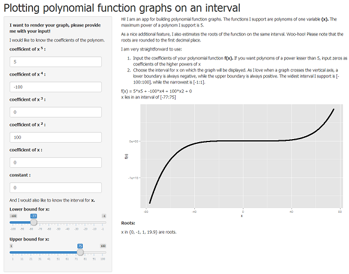
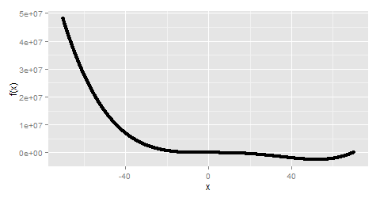

---

title       : Polynomial Function Plots
subtitle    : App for plotting and estimating roots of polynomial functions
author      : Ilia Lvov
job         : 
framework   : io2012        # {io2012, html5slides, shower, dzslides, ...}
highlighter : highlight.js  # {highlight.js, prettify, highlight}
hitheme     : tomorrow      # 
widgets     : [mathjax]            # {mathjax, quiz, bootstrap}
mode        : selfcontained # {standalone, draft}
knit        : slidify::knit2slides

---

## Application



Can be found online at https://ilialvov.shinyapps.io/polynomialplots/

---

## Benefits

1. Convinient and easy to use.
2. Fast in calculations and rendering.
3. Beautfifully interactive.
4. Polynoms of power up to 5 are supported.
5. A variety of intervals are supported.
6. Roots are additionally calculated.

---

## Example 1: Quartic Function

Let the app evaluate the following function on an interval [-70:70]**:

$$f(x) = x^4 - 70x^3 + 30x^2 - 10$$





```
## [1] "x in {-0.4, 69.6} are roots."
```

** Evaluations are actually performed in the code of this presentation,
however the app uses code a similar structure

---

## Example 2: Different Number of Roots

The app returns different messages in cases of no, one, multiple and infinite
number of roots:

No roots: $f(x) = 100, x \in [-50;50]$


```
## [1] "No roots on the interval found."
```

One root: $f(x) = 50x + 100, x \in [-30;70]$


```
## [1] "x = -2 is a root."
```

Multiple roots: $f(x) = x^2 - 100, x \in [-40;30]$


```
## [1] "x in {-10, 10} are roots."
```

Infinite number of roots: $f(x) = 0, x \in [-10;10]$


```
## [1] "Every x in the interval."
```
