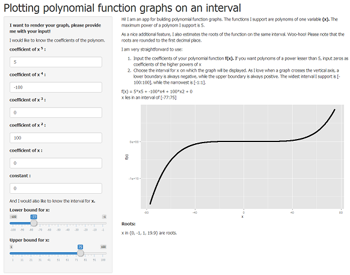
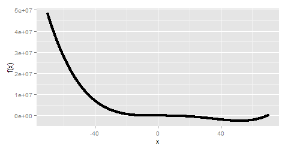

---

title       : Polynomial Function Plots
subtitle    : App for plotting and estimating roots of polynomial functions
author      : Ilia Lvov
job         : 
framework   : io2012        # {io2012, html5slides, shower, dzslides, ...}
highlighter : highlight.js  # {highlight.js, prettify, highlight}
hitheme     : tomorrow      # 
widgets     : [mathjax]            # {mathjax, quiz, bootstrap}
mode        : selfcontained # {standalone, draft}
knit        : slidify::knit2slides

---

## Application



Can be found online at https://ilialvov.shinyapps.io/polynomialplots/

---

## Benefits

1. Convinient and easy to use.
2. Fast in calculations and rendering.
3. Beautifully interactive.
4. Polynoms of power up to 5 are supported.
5. A variety of intervals are supported.
6. Roots are additionally calculated.

---

## Example 1: Quartic Function

Let the app evaluate the following function on an interval [-70:70]**:

$$f(x) = x^4 - 70x^3 + 30x^2 - 10$$

```{r setting_functions, echo=FALSE, results='hide', cache = FALSE}

suppressPackageStartupMessages(require(ggplot2))

functionGraph <- function(input) {
            x <- seq(input$xlow, input$xup, by = 0.01)
      y <- input$a5 * x^5 +
            input$a4 * x^4 +
            input$a3 * x^3 +
            input$a2 * x^2 +
            input$a1 * x +
            input$a0
      qplot(x, y) + ylab("f(x)")
      }


functionRoots <- function(input){
      is_null_coef <- (input$a5 == 0 & input$a4 == 0 &
                             input$a3 == 0 & input$a2 == 0 &
                             input$a1 == 0 & input$a0 == 0)
      if (is_null_coef) {
            return ('Every x in the interval.')
            } else {
                  x <- seq(input$xlow, input$xup, by = 0.01)
                  y <- input$a5 * x^5 +
                        input$a4 * x^4 +
                        input$a3 * x^3 +
                        input$a2 * x^2 +
                        input$a1 * x +
                        input$a0
                  roots <- numeric()
                  for (i in 1:length(x)) {
                        if (y[i] == 0) {
                              roots <- c(roots,x[i])
                              }
                        }
                  for (i in 1:(length(x)-1)) {
                        if (y[i]*y[i+1] < 0) {
                              roots <- c(roots, (x[i]+x[i+1])/2)
                              }
                        }
                  if (length(roots) == 0) {
                        return('No roots on the interval found.')
                        }
                  if (length(roots) == 1) {
                        return(paste0(
                              'x = ',
                              round(roots, digits = 1),
                              ' is a root.'))
                        }
                  if (length(roots) > 1) {
                        roots_string <- as.character(
                              round(roots[1], digits = 1))
                        for (i in 2:length(roots)) {
                              roots_string <- paste0(
                                    roots_string,
                                    ", ",
                                    round(roots[i], digits = 1))
                              }
                        return(paste0(
                              'x in {',
                              roots_string,
                              '} are roots.')) 
                        }
                  }
      }

```

``` {r example_1_plot, echo=FALSE, cache=FALSE, results='hide'}

input1 <- list(a5 = 0, a4 = 1, a3 = -70, a2 = 30,
               a1 = 0, a0 = - 10, xlow = -70, xup = 70)
png("assets/img/try.png", height = 250)
# I prefer to save it as a png to be in control of the size.
functionGraph(input1)
dev.off()
```



``` {r example_1_roots, echo=FALSE, cache=FALSE}
functionRoots(input1)
```

** Evaluations are actually performed in the code of this presentation,
however the app uses code of a similar structure

---

## Example 2: Different Number of Roots

The app returns different messages in cases of no, one, multiple and infinite
number of roots:

No roots: $f(x) = 100, x \in [-50;50]$

``` {r example_noroots, echo=FALSE, cache=FALSE}
input2 <- list(a5 = 0, a4 = 0, a3 = 0, a2 = 0,
               a1 = 0, a0 = 100, xlow = -50, xup = 50)
functionRoots(input2)
```

One root: $f(x) = 50x + 100, x \in [-30;70]$

``` {r example_oneroot, echo=FALSE, cache=FALSE}
input2 <- list(a5 = 0, a4 = 0, a3 = 0, a2 = 0,
               a1 = 50, a0 = 100, xlow = -30, xup = 70)
functionRoots(input2)
```

Multiple roots: $f(x) = x^2 - 100, x \in [-40;30]$

``` {r example_multiroots, echo=FALSE, cache=FALSE}
input2 <- list(a5 = 0, a4 = 0, a3 = 0, a2 = 1,
               a1 = 0, a0 = -100, xlow = -40, xup = 30)
functionRoots(input2)
```

Infinite number of roots: $f(x) = 0, x \in [-10;10]$

``` {r example_infiniteroots, echo=FALSE, cache=FALSE}
input2 <- list(a5 = 0, a4 = 0, a3 = 0, a2 = 0,
               a1 = 0, a0 = 0, xlow = -10, xup = 10)
functionRoots(input2)
```
